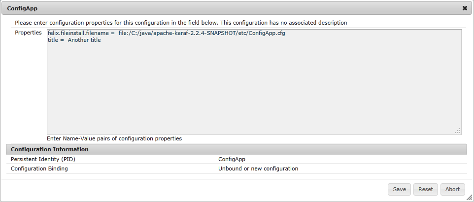

In [Karaf Tutorial Part 2 - Using the Configuration Admin Service](karaf-tutorial-02) we learned how to configure our bundles using simple configurations.

In this part we will learn how to use the Metatype Service and the Felix Webconsole to easily create and edit these configurations

### Using the Webconsole to edit an untyped Configuration

So when we have the Karaf container from Part 2 running and the config present we can already use the Felix Webconsole to edit the configuration.

```
> features:install webconsole
```

Open your browser with http://localhost:8181/system/console/configMgr.
You will see the list of configurations the config admin service knows about:

### Untyped Configuration

So the first thing we want to see is the untyped configuration. To see this copy the ConfigApp.cfg file from the git sources to the etc dir of Karaf. It should now be listed in the above list. If you click edit you will see the following:


So you get a freeform text editor with the current config. You can edit and save the config.The config is changed in the config admin service and internally persisted but not written to the etc dir (in current Karaf version).

Now delete the file from etc again. The config will not be shown in the list anymore.

### Typed configuration

Typed configuration can be defined using a config that complies to the [OSGi metatype service spec](https://osgi.org/specification/osgi.cmpn/7.0.0/service.metatype.html).
Now we will take a look at typed configuration. The Felix Webconsole can manage typed configurations using a nice editor. To do this simply create a file in the directory OSGI-INF/metatype.

For our configapp example the following configapp.xml will work:

```
 <?xml version="1.0" encoding="UTF-8"?>
MetaData xmlns="http://www.osgi.org/xmlns/metadata/v1.0.0"
     xmlns:xsi="http://www.w3.org/2001/XMLSchema-instance"
     xsi:schemaLocation="
         http://www.osgi.org/xmlns/metadata/v1.0.0 http://www.osgi.org/xmlns/metatype/v1.1.0/metatype.xsd
     "<
     <OCD description="Configured Example Application" name="ConfigApp" id="ConfigApp">
         <AD name="Title" id="title" required="true" type="String" default="Default Title" description="Title for the Application"/>
     </OCD>
     <Designate pid="ConfigApp">
         <Object ocdref="ConfigApp"/>
     </Designate>
</MetaData>
```

So this is just an xml file with the MetaType Namespace. The object class definition (OCD) Element represents a configuration.

| Attribute   | Description
|-------------|-------------
| id          | Id to reference in the designate element
| name        | User friendly name for editors
| description | Longer description for editors.

The  attribute definition (AD) represents an attribute.

| Attribute   | Description
|-------------|------------
| id          | ID for programmatic retrieval of this attribute
| name        | User friendly name to show in editors
| description | Longer description for editors
| required    | (true / false) Determines if this attribute has to be filled
| type        | (String / Long / Double / Float / Integer / Byte / Char / Boolean / Short)
| default     | Default value if the attribute is not yet present

The last thing to define is the Designate element which maps the object class defintion to a config admin pid.

#### Test the Typed Config

Now build the configapp project using mvn install and copy the configapp.jar to the deploy directory of Karaf. The Webconsole should now show the ConfigApp Element in the configurations tab even if no such config exists.

You can then click edit and should see the following screen:


So we get a nice form to edit our configuration and also get default values if we create a new config. A click on Save will create or update this config in the config admin service and out bundle will reflect the change.

To see a larger example you can edit the configuration of the felix fileinstall bundle which will show the following screen: 


### Summary

So we have learned how to edit typed and untyped configuration with the Felix Webconsole and how to define configuration metadata.
