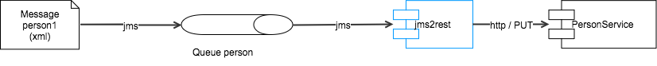

Shows how to run your camel routes in the OSGi server Apache Karaf. Like for CXF blueprint is used to boot up camel. The tutorial shows three examples - a simple blueprint route, a jms2rest adapter and an order processing example.

## Installing Karaf and making Camel features available

Download Karaf 4.1.x, unpack and start it.

In Karaf type:

```
feature:repo-add camel 2.16.2
feature:list
```

You should see the camel features that are now ready to be installed.

## Getting and building the examples

You can find the examples for this tutorial on github [Karaf Tutorial - camel](https://github.com/cschneider/Karaf-Tutorial/tree/master/camel).
Clone the repo locally.

```
cd camel
mvn clean install
```

## Starting simple with a pure blueprint deployment

Our first example does not even require a java project. In Karaf it is possible to deploy pure blueprint xml files. As camel is well integrated with blueprint you can define a complete camel context with routes in a simple blueprint file.

[simple-camel-blueprint.xml](https://raw.github.com/cschneider/Karaf-Tutorial/master/camel/simple-blueprint/simple-camel-blueprint.xml)

The blueprint xml for a camel context is very similar to the same in spring. Mainly the namespaces are different. Blueprint discovers the dependency on camel so it will automatically require the at least the camel-blueprint feature is installed. The camel components in routes are discovered as OSGi services. So as soon as a camel component is installed using the respective feature it is automatically available for usage in routes.

So to install the above blueprint based camel integration you only have to do the following steps:

```
feature:install camel-blueprint camel-stream
```

Copy simple-camel-blueprint.xml to the deploy folder of karaf. You should now see "Hello Camel" written to the console every 5 seconds.

The blueprint file will be automatically monitored for changes so any changes we do are directly reflected in Karaf. To try this open the simple-camel-blueprint.xml file from the deploy folder in an editor, change "stream:out" to "log:test" and save. Now the messages on the console should stop and instead you should be able to see "Hello Camel" in the Karaf log file formatted as a normal log line.

## JMS to REST Adapter (jms2rest)



This example is not completely standalone. As a prerequisite install the person service example like described in Karaf Tutorial 4.

The example shows how to create a bridge from the messaging world to a REST service. It is simple enough that it could be done in a pure blueprint file like the example above. As any bigger integration needs some java code I opted to use a java project for that case.

Like most times we mainly use the maven bundle plugin with defaults and the packaging type bundle to make the project OSGi ready. The camel context is booted up using a blueprint file blueprint.xml and the routes are defined in the java class [Jms2RestRoute](https://github.com/cschneider/Karaf-Tutorial/blob/master/camel/jms2rest/src/main/java/net/lr/tutorial/karaf/camel/jms2rest/Jms2RestRoute.java).

### Routes

The first route watches the directory "in" and writes the content of any file placed there to the jms queue "person". It is not strictly necessary but makes it much simpler to test the example by hand.

The seconds route is the real jms2rest adapter. It listens on the jms queue person and expects to get xml content with persons like also used in the PersonService. In the route the id of the person is extracted from the xml and stored in a camel message header. This header is then used to build the rest uri. As a last step the content from the message is sent to the rest uri with a PUT request. So this tells the service to store the person with the given id and data.

### Use of Properties

Besides the pure route the example shows some more tpyical things you need in camel. So it is a good practice to externalize the url of services we access. Camel uses the Properties component for this task.

 This enables us to write {{personServiceUri}} in endpoints or ${properties:personServiceUri} in the simple language.
In a blueprint context the Properties component is automatically aware of injected properties from the config admin service. We use a cm:property-placeholder definition to inject the attributes of the config admin pid "net.lr.tutorial.karaf.cxf.personservice". As there might be no such pid we also define a default value for the personServiceUri so the integration can be deployed without further configuation.

### JMS Component

We are using the camel jms component in our routes. This is one of the few components that need further configuration to work. We also do this in the blueprint context by defining a JmsComponent and injecting a connection factory into it. In OSGi it is good practice to not define connection factories or data sources directly in the bundle instead we are simply refering to it using a OSGi service reference.

### Deploying and testing the jms2rest Adapter

Just type the following in Karaf:

```
feature:repo-add activemq 5.12.2
feature:repo-add camel 2.16.2
feature:install  camel-blueprint camel-jms camel-http camel-saxon activemq-broker jms
jms:create -t activemq localhost
install -s mvn:net.lr.tutorial.karaf.camel/example-jms2rest/1.0-SNAPSHOT
```

This installs the activemq and camel feature files and features in karaf. The activemq:create command creates a broker defintions in the deploy folder. This broker is then automatically started. The broker defintion also publishes an OSGi service for a suitable connection factory. This is then referenced later by our bundle.

As a last step we install our own bundle with the camel route.

Now the route should be visible when typing:

```
> camel:route-list
Route Id             Context Name         Status
[file2jms          ] [jms2rest          ] [Started           ]
[personJms2Rest    ] [jms2rest          ] [Started           ]
```

Now copy the file src/test/resources/person1.xml to the folder "in" below the karaf directory. The file should be sent to the queue person by the first route and then sent to the rest service by the second route.

In case the personservice is instaleld you should now see a message like "Update request received for ...". In case it is not installed you should see a 404 in the karaf error when accessing the rest service.

## Order processing example


The business case in this example is a shop that partly works with external vendors.

We receive an order as an xml file (See: order1.xml). The order contains a customer element and several item elements. Each item specifies a vendor. This can be either "direct" when we deliver the item ourself or a external vendor name. If the item vendor is "direct" then the item should be exported to a file in a directory with the customer name. All other items are sent out by mail. The mail content should be customizeable. The mail address has to be fetched from a service that maps vendor name to mail address.

### How it works

This example again uses maven to build, a blueprint.xml context to boot up camel and a java class OrderRouteBuilder for the camel routes. So from an OSGi perspective it works almost the same as the jms2rest example.

The routes are defined in net.lr.tutorial.karaf.camel.order.OrderRouteBuilder. The "order" route listens on the directory "orderin" and expects xml order files to be placed there. The route uses xpath to extract several attributes of the order into message headers. A splitter is used to handle each (/order/item) spearately. Then a content based router is used to handle "direct" items different from others.

In the case of a direct item the recipientlist pattern is used to build the destination folder dynamically using a simple language expression.

```
recipientList(simple("file:ordersout/${header.customer}"))
```

If the vendor is not "direct" then the route "mailtovendor" is called to create and send a mail to the vendor. Some subject and to address are set using special header names that the mail component understands. The content of the mail is expected in the message body. As the body also should be comfigureable the velocity component is used to fill the mailtemplate.txt with values from the headers that were extracted before.

### Deploy into karaf

The deployment is also very similar to the previous example but a little simpler as we do not need jms. Type the following in karaf

```
feature:repo-add camel 2.16.2
feature:install camel-blueprint camel-mail camel-velocity camel-stream
install -s mvn:net.lr.tutorial.karaf.camel/example-order/1.0-SNAPSHOT
```

To be able to receive the mail you have to edit the configuration pid. You can either do this by placing a properties file
into etc/net.lr.tutorial.karaf.cxf.personservice.cfg or editing the config pid using the karaf webconsole. (See part 2 and part 3 of the Karaf Tutorial series).

Basically you have to set these two properties according to your own mail environment.

```
mailserver=yourmailserver.com
testVendorEmail=youmail@yourdomain.com
```

### Test the order example

Copy the file order1.xml into the folder "ordersin" below the karaf dir.

The Karaf console will show:

```
Order from Christian Schneider

Count: 1, Article: Flatscreen TV
The same should be in a mail in your inbox. At the same time a file should be created in ordersout/Christian Schneider/order1.xml that contains the book item.
```

## Wrapping it up and outlook

The examples show that fairly sophisticated integrations can be done using camel and be nicely deployed in an Apache Karaf container. The examples also show some best practices around configuration management, jms connection factories and templates for customization. The examples should also provide a good starting point for you own integration projects. Many people are a bit hesitant using OSGi in production. I hope these simple examples can show how easy this is in practice. Still problems can arise of course. For that case it is advisable to think about getting a support contract from a vendor like Talend. The whole Talend Integration portfolio is based on Apache Karaf so we are quite experienced in this area.

I have left out one big use case for Apache Camel in this tutorial - Database integrations. This is a big area and warrants a separate tutorial that will soon follow. There I will also explain how to handle DataSources and Connection Factories with drivers that are not already OSGi compliant.

[Back to Karaf Tutorials](..)
