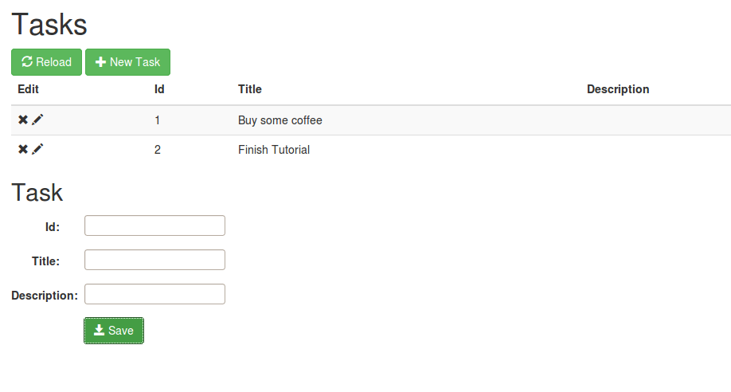

Shows how to create a small application with a model, persistence layer and UI just with CDI annotations running as blueprint.

## blueprint-maven-plugin

Writing blueprint xml is quite verbose and large blueprint xmls are difficult to keep in sync with code changes and especially refactorings. So many people prefer to do most declarations using annoations. Ideally these annotations should be standardized so it is clearly defined what they do. The aries maven-blueprint-plugin allows to configure blueprint using annotations. It scans one or more paths for annotated classes and creates a blueprint.xml in target/generated-resources. See aries documentation of the maven-blueprint-plugin.

Example tasklist-blueprint-cdi
This example shows how to create a small application with a model, persistence layer and UI completely without handwritten blueprint xml.

You can find the full source code on github Karaf-Tutorial/tasklist-cdi-blueprint

## Structure

* features
* model
* persistence
* ui

## Creating the bundles

The bundles are created using the maven bundle plugin. The plugin is only used in the parent project and uses `<_include>osgi.bnd</_include>` to extract the OSGi configs into a separate file. So each bundle project just needs a osgi.bnd file which is empty by default and can contain additional configs.

As bnd figures out most settings automatically the osgi.bnd file are typically very small.

## Features

Defines the karaf features to install the example as well as all necessary dependencies.

## Model

The model project defines Task as a jpa entity and the Service TaskService as an interface. As model does not do any dependency injection the blueprint-maven-plugin is not involved here.

```
@Entity
public class Task {
    @Id
    Integer id;
    String title;
    String description;
    Date dueDate;
    boolean finished;
    // Getters and setters omitted
}


public interface TaskService {
    Task getTask(Integer id);
    void addTask(Task task);
    void updateTask(Task task);
    void deleteTask(Integer id);
    Collection<Task> getTasks();
}
```

```
<persistence version="2.0" xmlns="http://java.sun.com/xml/ns/persistence"
    xmlns:xsi="http://www.w3.org/2001/XMLSchema-instance"
    xsi:schemaLocation="http://java.sun.com/xml/ns/persistence http://java.sun.com/xml/ns/persistence/persistence_2_0.xsd">

    <persistence-unit name="tasklist" transaction-type="JTA">
        <provider>org.hibernate.jpa.HibernatePersistenceProvider</provider>
        <jta-data-source>osgi:service/tasklist</jta-data-source>
        <properties>
            <property name="hibernate.dialect" value="org.hibernate.dialect.H2Dialect"/>
            <property name="hibernate.hbm2ddl.auto" value="create-drop"/>
        </properties>
    </persistence-unit>

</persistence>
```

Persistence.xml defines the persistence unit name as "tasklist" and to use JTA transactions. The jta-data-source points to the jndi name of the DataSource service named "tasklist". So apart from the JTA DataSource name it is a normal hibernate 4.3 style persistence definition with automatic schema creation.

One other important thing is the configuration for the maven-bundle-plugin.

```
<Meta-Persistence>META-INF/persistence.xml</Meta-Persistence>
<Import-Package>*, org.hibernate.proxy, javassist.util.proxy</Import-Package>
The Meta-Persistence points to the persistence.xml and is the trigger for aries jpa to create an EntityManagerFactory for this bundle.
The Import-Package configurations import two packages that are needed by the runtime enhancement done by hibernate. As this enhancement is not known at compile time we need to give the maven bundle plugin these hints.
```

## Persistence

The tasklist-cdi-persistence bundle is the first module in the example to use the blueprint-maven-plugin. In the pom we set the scanpath to "net.lr.tasklist.persistence.impl". So all classes in this package and sub packages are scanned.

In the pom we need a special configuration for the maven bundle plugin:
```
<Import-Package>!javax.transaction, *, javax.transaction;version="[1.1,2)"</Import-Package>
```

In the dependencies we use the transaction API 1.2 as it is the first spec version to include the @Transactional annotation. At runtime though we do not need this annotation and karaf only provides the transaction API version 1.1. So we tweak the import to be ok with the version karaf offers. As soon as the transaction API 1.2 is available for karaf this line will not be necessary anymore.

```
@OsgiServiceProvider(classes = {TaskService.class})
@Singleton
@Transactional
public class TaskServiceImpl implements TaskService {
    @PersistenceContext(unitName="tasklist")
    EntityManager em;
    @Override
    public Task getTask(Integer id) {
        return em.find(Task.class, id);
    }
    @Override
    public void addTask(Task task) {
        em.persist(task);
        em.flush();
    }
    // Other methods omitted
}
```

TaskServiceImpl uses quite a lot of the annotations. The class is marked as a blueprint bean using @Singleton. It is also marked to be exported as an OSGi Service with the interface TaskService.

The class is marked as @Transactional. So all methods are executed in a jta transaction of type Required. This means that if there is no transaction it will be created. If there is a transaction the method will take part in it. At the end of the transaction boundary the transaction is either committed or in case of an exception it is rolled back.

A managed EntityManager for the persistence unit "tasklist" is injected into the field em. It transparently provides one EntityManager per thread which is created on demand and closed at the end of the transaction boundary.

```
@Singleton
public class InitHelper {
    Logger LOG = LoggerFactory.getLogger(InitHelper.class);
    @Inject TaskService taskService;
    @PostConstruct
    public void addDemoTasks() {
        try {
            Task task = new Task(1, "Just a sample task", "Some more info");
            taskService.addTask(task);
        } catch (Exception e) {
            LOG.warn(e.getMessage(), e);
        }
    }
}
```

The class InitHelper is not strictly necessary. It simply creates and persists a first task so the UI has something to show. Again the @Singleton is necessary to mark the class for creation as a blueprint bean.
@Inject TaskService taskService injects the first bean of type TaskService it finds in the blueprint context into the field taskService. In our case this is the implementation above.
@PostConstruct makes sure that addDemoTasks() is called after injection of all fields of this bean.

Another interesting thing in the module is the test TaskServiceImplTest. It runs outside OSGi and uses a special persistence.xml for testing to create the EntityManagerFactory without a jndi DataSource which would be difficult to supply. It also uses RESOURCE_LOCAL transactions so we do not need to set up a transaction manager. The test injects the plain EntityManger into the TaskServiceImpl class. So we have to manually begin and commit the transaction. So this shows that you can test the JPA code with plain java which results in very simple and fast tests.

## Servlet UI
The tasklist-ui module uses the TaskService as an OSGi service and publishes a Servlet as an OSGi service. The Pax-web whiteboard bundle will then pick up the exported servlet and publish it using the HttpService so it is available on http.
In the pom this module needs the blueprint-maven-plugin with a suitable scanPath.

```
@OsgiServiceProvider(classes={Servlet.class})
@Properties({@Property(name="alias", value="/tasklist")})
@Singleton
public class TaskListServlet extends HttpServlet {
    @Inject @OsgiService
    TaskService taskService;
    protected void doGet(HttpServletRequest req, HttpServletResponse resp) throws ServletException,
        IOException {
        // Actual code omitted
    }
}
```

The TaskListServlet is exported with the interface javax.servlet.Servlet with the service property alias="/tasklist". So it is available on the url http://localhost:8181/tasklist.

@Inject @OsgiService TaskService taskService creates a blueprint reference element to import an OSGi service with the interface TaskService. It then injects this service into the taskService field of the above class.
If there are several services of this interface the filter property can be used to select one of them.

## Abgular JS / Bootstrap UI



The Angular UI is just a bundle that statically exposes a html and js resource. It uses Angular and Bootstrap to create a nice looking and functional interface. The Tasks are read and manipulated using the Tasklist REST service.As the code completely runs on the client there is not much to talk about it from the blueprint point of view.

The example uses $http to do the rest requests. This is because I am not yet familiar enough with the $resource variant which would better suit the rest concepts.

From the OSGi point of view the Angular UI bundle simply sets the Header Web-ContextPath: /tasklist and provides the html and js in the src/main/resources folder.

## Build

```
mvn clean install
```

Installation and test
See [Readme.txt on github](../../tasklist-blueprint-cdi/README.md).
